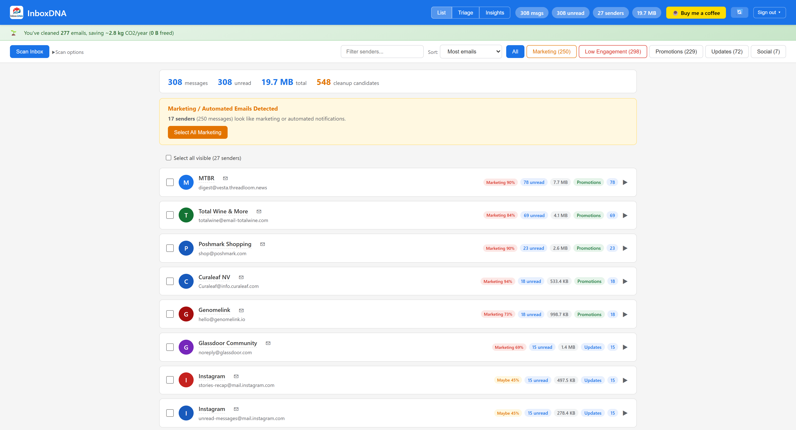
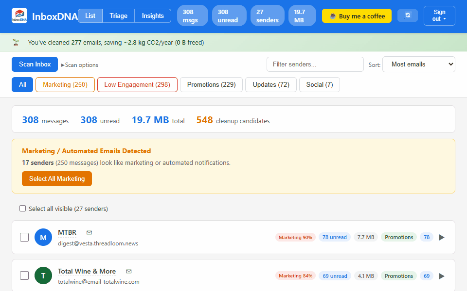

# InboxDNA

A local-first Gmail inbox analyzer and cleanup tool. Your emails never leave your machine.

    





## Why InboxDNA?

Cloud email cleaners (Clean Email, SaneBox, Unroll.me) require full access to your mailbox on their servers. InboxDNA runs entirely on your computer — no third-party servers, no data collection, no subscriptions.

## Features

- **Bulk Cleanup** — Scan your inbox, see top senders, delete/block/unsubscribe in bulk
- **Triage Mode** — Rapid one-click review: keep, archive, delete, block, or unsubscribe per sender
- **Inbox Hygiene Score** — 0-100 composite score with streaks and badges
- **Storage Cost Visualizer** — Treemap of storage by sender, Google One cost estimates
- **Subscription Decay Radar** — Spot subscriptions you've stopped reading
- **Quiet Hours Heatmap** — See when emails arrive (and who's emailing at 3am)
- **Reply Debt Tracker** — Find unanswered emails that need a response
- **Inbox Time Machine** — Track inbox growth and composition over time
- **Ghost Rules** — Auto-suggest Gmail filters from your triage patterns
- **Email DNA Cards** — Deep profile for any sender (frequency, tracking pixels, dark patterns)
- **Privacy Audit** — Scan for tracking pixels, sensitive data exposure, known trackers
- **Dark Mode** — Automatic (follows OS) or manual toggle between light, dark, and auto themes
- **Keyboard Shortcuts** — J/K to navigate, X to select, E to archive, ? for help

## Install

### Option A: pip install (recommended)

```bash
pip install inboxdna
inboxdna
```

### Option B: Run from source

```bash
git clone https://github.com/blaiseratcliffe/inboxdna.git
cd inboxdna
python -m venv venv
source venv/bin/activate  # Windows: venv\Scripts\activate
pip install -e .
inboxdna
```

### Option C: Standalone executable (Windows / macOS / Linux)

Download the binary for your platform from the [Releases](https://github.com/blaiseratcliffe/inboxdna/releases) page and run it. No Python required.

| Platform | File | How to run |
|----------|------|-----------|
| Windows | `InboxDNA.exe` | Double-click or run from terminal |
| macOS | `InboxDNA` | `chmod +x InboxDNA && ./InboxDNA` |
| Linux | `InboxDNA` | `chmod +x InboxDNA && ./InboxDNA` |

---

InboxDNA automatically opens your browser on startup. On first run you'll be asked to sign in with your Google account.

## Google Sign-In

InboxDNA includes pre-configured OAuth credentials so you can start using it immediately — no Google Cloud setup required. Just click **Scan Inbox** and sign in when prompted.

When you authorize InboxDNA for the first time, Google will show a warning that says **"Google hasn't verified this app"**. This is normal and expected for open-source projects. To proceed:

1. Click **"Advanced"**
2. Click **"Go to InboxDNA (unsafe)"**
3. Review the permissions and click **"Allow"**

### Why does this warning appear?

Google requires apps that access Gmail to go through a formal security review (CASA audit). This process is designed for commercial SaaS products and costs thousands of dollars — it doesn't make sense for a free, open-source, local-only tool.

The warning does **not** mean InboxDNA is unsafe. It means Google hasn't reviewed it. You can verify this yourself: the entire source code is right here, and your data never leaves your machine. InboxDNA talks directly to Gmail's API from your computer — there is no intermediary server.

### What permissions does InboxDNA request?

| Scope | What it does | Why it's needed |
|-------|-------------|-----------------|
| `gmail.modify` | Read, delete, archive, and label messages | Core inbox cleanup features |
| `gmail.labels` | Create and manage labels | Organize emails by label |
| `gmail.settings.basic` | Create email filters | Ghost Rules (auto-filter suggestions) |

InboxDNA does **not** request permission to send emails on your behalf.

### Switching accounts

Click the **Sign out** dropdown in the top-right corner of the app:

- **Sign out** — Removes your auth token and clears the message cache. Sign in with a different account on next scan.
- **Delete local data & sign out** — Permanently deletes all local data (database, history, scores) and signs out.

### Using your own credentials (optional)

If you prefer to use your own Google Cloud project instead of the bundled credentials:

1. Go to [Google Cloud Console](https://console.cloud.google.com/)
2. Create a project and enable the **Gmail API**
3. Create an **OAuth 2.0 Client ID** (Desktop app)
4. Download the JSON and save it as `credentials.json` in `~/.inboxdna/`

InboxDNA will use your `credentials.json` if present, falling back to the bundled credentials otherwise.

## Where is my data stored?

All data is stored locally in `~/.inboxdna/`:

| File | Contents |
|------|----------|
| `email_organizer.db` | SQLite database (cached inbox data, scores, history) |
| `token.json` | Your Gmail OAuth token (owner-only permissions) |
| `stats.json` | Cleanup statistics |
| `.flask_secret` | Session key (persists across restarts) |

Standalone executables store data in platform-appropriate locations:

| Platform | Data location |
|----------|--------------|
| Windows exe | `%LOCALAPPDATA%\InboxDNA` |
| macOS exe | `~/Library/Application Support/InboxDNA` |
| Linux exe | `~/.local/share/InboxDNA` |

You can override the data location on any platform by setting the `INBOXDNA_DATA_DIR` environment variable.

## Tech Stack

- **Backend:** Python / Flask, served via [Waitress](https://docs.pylonsproject.org/projects/waitress/) (production WSGI server)
- **Frontend:** Single-page HTML with inline JS/CSS, WCAG 2.1 AA accessible
- **Database:** SQLite with WAL mode (local, per-thread connections)
- **API:** Google Gmail API via OAuth 2.0
- **CI/CD:** GitHub Actions — automated testing on 3 OSes / 3 Python versions, cross-platform release builds

## Security

InboxDNA includes the following security measures:

- CSRF protection via Origin/Referer header validation on all mutating requests
- Explicit localhost-only binding (`127.0.0.1`)
- Security headers: CSP, X-Frame-Options DENY, X-Content-Type-Options nosniff
- Input validation on all API endpoints (message ID format, type, length caps)
- OAuth token stored with restrictive file permissions (`0600`)
- Thread-safe auth with locking, per-thread SQLite connections with busy timeout
- Production WSGI server (Waitress) — no debug mode warnings

## Privacy

InboxDNA is 100% local. No telemetry, no analytics, no external services beyond the Gmail API. Your data stays in a SQLite file on your machine.

Your OAuth token is stored locally and is never transmitted anywhere. You can revoke access at any time from your [Google Account permissions page](https://myaccount.google.com/permissions), or use the **Sign out** button in the app.

## Building standalone executables

```bash
pip install pyinstaller
python build_exe.py
```

This produces a single-file binary in `dist/` for whatever platform you're building on. PyInstaller must be run on each target OS — cross-compilation is not supported. Releases are built automatically via GitHub Actions when a version tag is pushed.

| Build OS | Output |
|----------|--------|
| Windows | `dist/InboxDNA.exe` (~34 MB) |
| macOS | `dist/InboxDNA` (Unix binary) |
| Linux | `dist/InboxDNA` (Unix binary) |

## Support

If InboxDNA saves you time, consider buying me a coffee:

[](https://buymeacoffee.com/inboxdna)

## License

Apache 2.0 — see [LICENSE](LICENSE)
